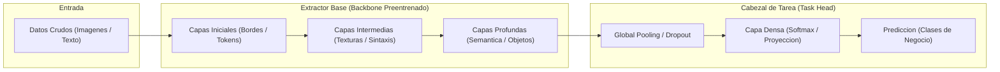

# Playbook Estrategico y Tecnico: Transfer Learning en Inteligencia Artificial

**Guia Integral de Arquitectura, Metodologia, Ecosistema de Herramientas (Keras, Hugging Face, PyTorch) y Estrategia de Negocio (Sesion 2)**

- **Audiencia Objetivo:** Ingenieros de Machine Learning, Arquitectos de Soluciones de IA, Tech Leads y Cientificos de Datos.
- **Ambito Tecnico:** Estrategias de adaptacion y especializacion de modelos profundos preentrenados (Vision, Procesamiento de Lenguaje Natural y Modelos Multimodales), minimizando el requerimiento de computo y volumen de datos etiquetados.

---

## 1. Fundamentos Conceptuales de Transfer Learning

El **Aprendizaje por Transferencia (Transfer Learning)** es un paradigma del Aprendizaje Automatico en el cual el conocimiento adquirido por un modelo al resolver una tarea inicial a gran escala (dominio fuente) se almacena, preserva y transfiere para solucionar un problema secundario en un dominio diferente pero relacionado (dominio destino).

En lugar de iniciar el entrenamiento con inicializaciones aleatorias de pesos (hoja en blanco), se aprovechan representaciones latentes universales ya optimizadas sobre millones de parametros y conjuntos masivos de datos.

### Analogias Clave
- **Conduccion de Vehiculos:** Una persona con experiencia consolidada en el manejo de automoviles estandar aprende a conducir un camion articulado en semanas, puesto que ya domina principios de inercia, interpretacion de senales de transito y calculo espacial de frenado.
- **Adquisicion de Lenguas Romances:** Un hablante nativo de espanol asimila el italiano o portugues con un esfuerzo cognitivo sustancialmente menor gracias a las estructuras morfosintacticas y raices lexicas compartidas.

### Descomposicion Estructural del Modelo
Cualquier arquitectura adaptada bajo Transfer Learning se divide formalmente en dos bloques funcionales:

1. **Extractor de Caracteristicas (Backbone):**
   Conjunto de capas profundas preentrenadas (convoluciones, bloques residuales o capas de autoatencion) que transforman la entrada bruta (pixeles, secuencias de tokens, espectrogramas) en vectores de caracteristicas altamente informativos, jerarquicos y compactos.
2. **Cabeza de Decision (Task Head):**
   Conjunto de capas finales especificas (generalmente capas densas de proyeccion, pooling global o capas de agrupamiento) que mapean las caracteristicas extraidas hacia el espacio de etiquetas o salidas requeridas por el caso de uso del negocio.



---

## 2. Ventajas Estrategicas y Justificacion Financiera

La adopcion de Transfer Learning transforma radicalmente la ecuacion economica y operacional en proyectos de Inteligencia Artificial:

- **Demanda Minima de Muestras Etiquetadas:**
  Permite obtener resultados con calidad de produccion empleando conjuntos de cientos o pocos miles de ejemplos, superando la barrera de entrada de requerir almacenes de datos masivos.
- **Reduccion Drastica de Costos de Computo (CapEx / OpEx):**
  Evita semanas de procesamiento en clusteres masivos de GPUs de alto rendimiento. Reduce el consumo energetico y la inversion en infraestructura a minutos u horas de entrenamiento.
- **Aceleracion del Time-to-Market:**
  Habilita la construccion rapida de pruebas de concepto (PoC) y el despliegue iterativo de productos minimos viables (MVP) en dias en lugar de trimestres.
- **Mayor Capacidad de Generalizacion:**
  Al partir de modelos preentrenados sobre corpus multidimensionales (como ImageNet o Common Crawl), la solucion resultante presenta una menor tasa de sobreajuste (*overfitting*) ante ruido o casos atipicos en el dominio destino.

---

## 3. Limitaciones, Riesgos Tecnicos y Mitigacion

A pesar de sus beneficios, el Transfer Learning presenta vectores de riesgo tecnico que deben gestionarse con rigor de ingenieria:

| Riesgo Tecnico | Manifestacion | Estrategia de Mitigacion |
|---|---|---|
| **Transferencia Negativa (Negative Transfer)** | Si la distancia de distribucion entre el dominio fuente y el dominio destino es pronunciada, las caracteristicas previas perjudican el rendimiento del modelo. | Evaluar la discrepancia de medias (*Maximum Mean Discrepancy* - MMD). Utilizar unicamente capas tempranas o seleccionar modelos preentrenados con mayor afinidad de dominio. |
| **Olvido Catastrofico (Catastrophic Forgetting)** | Durante el reentrenamiento, los gradientes elevados desestabilizan y destruyen las representaciones latentes consolidadas en el backbone. | Aplicar descongelamiento gradual (*gradual unfreezing*), regularizacion L2-SP o tecnicas PEFT con tasas de aprendizaje discriminativas. |
| **Herencia de Sesgos** | Los modelos fundacionales reflejan sesgos demograficos, culturales o representacionales presentes en sus datos base. | Implementar protocolos de auditoria de imparcialidad y matrices de desbalance sobre subgrupos de prueba antes de autorizar el pase a produccion. |
| **Cumplimiento y Licenciamiento** | Restricciones de propiedad intelectual o incompatibilidad de licencias comerciales en los pesos base. | Auditar formalmente las licencias de uso de los checkpoints (MIT, Apache 2.0, OpenRAIL o licencias comerciales restringidas). |

---

## 4. Metodologias de Ejecucion: Feature Extraction vs. Fine-Tuning

Existen dos aproximaciones metodologicas primarias para transferir representaciones, diferenciadas por el estado de congelamiento de los pesos y el presupuesto computacional:

| Criterio Tecnico | Extraccion de Caracteristicas (Feature Extraction) | Ajuste Fino (Fine-Tuning) |
|---|---|---|
| **Estado de la Base** | **100% congelada** (`trainable = False` / `requires_grad = False`). | **Capas superiores descongeladas progresivamente** tras estabilizar el cabezal. |
| **Tasa de Aprendizaje (LR)** | Estandar para la cabeza (ej. `1e-3` o `5e-4`). | **Muy reducida en la base** (ej. `1e-5` a `5e-6`) para evitar destruccion de pesos. |
| **Costo Computacional** | **Minimo.** Solo se calcula el pase hacia adelante en la base; los gradientes solo fluyen por la cabeza. | **Moderado a alto**, segun la cantidad de capas descongeladas y la memoria de video requerida. |
| **Volumen Recomendado** | Ideal para datasets limitados (**< 1,000 muestras**). | Apropiado para datasets medianos o grandes (**> 5,000 muestras**). |

---

## 5. Matriz de Decision Operativa

La seleccion de la estrategia optima depende de dos variables cardinales: el volumen de datos etiquetados disponible y el grado de similitud semantica con la tarea base:

```mermaid
quadrantChart
    title Matriz de Decision: Volumen vs Similitud Semantica
    x-axis Baja Similitud Semantica --> Alta Similitud Semantica
    y-axis Bajo Volumen de Datos --> Alto Volumen de Datos
    quadrant-1 Fine-Tuning Progresivo (Capas Superiores)
    quadrant-2 Fine-Tuning Integral o Dominio Intermedio
    quadrant-3 Solo Capas Iniciales + Data Augmentation
    quadrant-4 Extraccion Pura de Caracteristicas
```

| Volumen de Datos | Similitud con Tarea Base | Estrategia Recomendada | Punto de Control Critico |
|---|---|---|---|
| **Bajo (< 1k)** | **Alta afinidad semantica** | Extraccion pura de caracteristicas con backbone congelado. | Evitar sobreajuste (*overfitting*) en la capa densa mediante Dropout y regularizacion L2. |
| **Bajo (< 1k)** | **Baja afinidad semantica** | Aprovechar solo capas iniciales y aplicar aumentacion agresiva de datos. | Alto riesgo de divergencia; monitorear la perdida de validacion en las primeras epocas. |
| **Alto (> 20k)** | **Alta afinidad semantica** | Fine-Tuning progresivo de las ultimas capas con tasa de aprendizaje baja. | Calibracion de regularizacion por decaimiento de peso (*weight decay*). |
| **Alto (> 50k)** | **Baja afinidad semantica** | Fine-Tuning integral o preentrenamiento de dominio intermedio. | Supervisar consumo de VRAM, escalado de gradientes y guardado periodico de checkpoints. |

---

## 6. Herramientas y Frameworks Lideres

### A. Keras y Keras Applications
Keras provee una interfaz intuitiva y declarativa para transfer learning mediante el submodulo nativo `keras.applications`, ofreciendo decenas de arquitecturas preentrenadas (ResNet, MobileNet, EfficientNet, ConvNeXt, VGG, DenseNet).

#### Implementacion Canonica de Transfer Learning en 2 Fases con Keras:
```python
import keras
from keras import layers

# 1. Carga del extractor base sin la cabeza original
base_model = keras.applications.EfficientNetB0(
    weights="imagenet",
    include_top=False,
    input_shape=(224, 224, 3)
)

# 2. Congelacion explicita del extractor
base_model.trainable = False

# 3. Construccion del modelo funcional con cabeza adaptada
inputs = keras.Input(shape=(224, 224, 3))
# training=False garantiza que BatchNormalization opere en modo inferencia
x = base_model(inputs, training=False)
x = layers.GlobalAveragePooling2D()(x)
x = layers.Dropout(0.2)(x)
outputs = layers.Dense(10, activation="softmax")(x)
model = keras.Model(inputs, outputs)

# 4. Fase 1: Entrenamiento del cabezal de clasificacion (Warm-up)
model.compile(
    optimizer=keras.optimizers.Adam(learning_rate=1e-3),
    loss="categorical_crossentropy",
    metrics=["accuracy"]
)
model.fit(train_dataset, epochs=5)

# 5. Fase 2: Fine-Tuning progresivo con descongelamiento selectivo
base_model.trainable = True
# Mantener congeladas todas las capas excepto las ultimas 20
for layer in base_model.layers[:-20]:
    layer.trainable = False

# Tasa de aprendizaje drasticamente reducida para preservar representaciones
model.compile(
    optimizer=keras.optimizers.Adam(learning_rate=1e-5),
    loss="categorical_crossentropy",
    metrics=["accuracy"]
)
model.fit(train_dataset, epochs=10)
```

---

### B. Hugging Face (Transformers y Hugging Face Hub)
Estandar de facto para Procesamiento de Lenguaje Natural (NLP), modelos multimodales y vision por computadora. El ecosistema aloja cientos de miles de modelos listos para adaptacion inmediata.

- **AutoModel API:** Clases como `AutoModelForSequenceClassification` o `AutoModelForImageClassification` instancian el backbone y reemplazan automaticamente la capa de logits para la cantidad requerida de clases.
- **Trainer Engine:** Abstrae el ciclo de entrenamiento distribuido, evaluacion con metricas configurables, gradiente acumulado (*gradient accumulation*) y guardado del mejor punto de control (*best checkpoint*).

---

### C. PyTorch y timm (PyTorch Image Models)
Mientras que `torchvision.models` cubre las arquitecturas canonicas, la libreria **`timm`** de Ross Wightman es el referente para vision por computador moderna, con soporte para mas de 1,000 modelos (Vision Transformers, Swin, ConvNeXt, EVA). Permite controlar granularmente los grupos de parametros para asignar tasas de aprendizaje diferenciadas (*discriminative learning rates*).

---

### D. Fastai
Libreria construida sobre PyTorch que encapsula las mejores practicas de la literatura en un unico metodo: `learn.fine_tune()`. Este metodo congela automaticamente la base, entrena la cabeza, la descongela y aplica la politica de aprendizaje *1cycle policy* con tasas escalonadas sin intervencion manual.

---

### E. PEFT y LoRA (Adaptacion Eficiente de Parametros)
Para Modelos de Lenguaje Grande (LLMs) como Llama, Gemma o Mistral, el ajuste fino completo es inviable en servidores convencionales. Librerias como **PEFT** implementan **LoRA (Low-Rank Adaptation)** y **QLoRA**, inyectando pequenas matrices de rango bajo en las capas de atencion mientras el modelo base permanece congelado, reduciendo el requerimiento de memoria VRAM en mas de un 75%.

---

## 7. Casos de Uso Industriales

- **Imagenologia Medica:**
  Diagnostico asistido de neumonia y nodulos en radiografias de torax. Se parte de modelos convolucionales o Vision Transformers preentrenados en ImageNet y se adapta la cabeza final utilizando 500 a 1,000 estudios validados por especialistas radiologos.
- **Soporte y Atencion al Cliente:**
  Enrutamiento inteligente de tickets de incidencias en plataformas de comercio electronico y soporte IT. Modelos de lenguaje como RoBERTa o ModernBERT se ajustan sobre tickets clasificados previamente, reduciendo el tiempo medio de resolucion en un 60%.
- **Control de Calidad en Manufactura (Edge AI):**
  Deteccion de grietas y micro-defectos superficiales en lineas de produccion a alta velocidad. Modelos ultraligeros tipo MobileNetV3 se congelan con Keras y se compilan con TensorFlow Lite / LiteRT o TensorRT para operar en tiempo real en camaras embebidas.

---

## 8. Reglas de Oro de Ingenieria en Produccion

1. **Curaduria Rigurosa sobre Volumen Bruto:**
   La consistencia y limpieza del etiquetado supera en impacto al volumen de datos. 500 datos perfectamente curados generan un mejor limite de decision que 15,000 datos ruidosos o mal etiquetados.
2. **Alineacion Estricta de Preprocesamiento:**
   Es mandatorio aplicar exactamente las mismas transformaciones (normalizacion de canales, medias, desviaciones estandar, tokenizadores) con las que fue entrenado el modelo base. Cualquier discrepancia en el preprocesamiento invalida la transferencia de pesos.
3. **Fusion de Pesos para Inferencia en Produccion:**
   Al utilizar tecnicas de adaptacion eficiente como LoRA, las matrices de rango bajo deben fusionarse con los pesos base (`merge_and_unload()`) antes del despliegue para eliminar latencias adicionales de computo en inferencia.
4. **Validacion de Linea Base Previa (*Baseline*):**
   Antes de desplegar modelos adaptados de gran escala, debe evaluarse el desempeno de un clasificador lineal o modelo simple sobre las representaciones base para cuantificar objetivamente el Retorno de Inversion (ROI) tecnico del fine-tuning.

---

## 9. Referencias Academicas y Documentacion Tecnica

1. **Pan, S. J., & Yang, Q. (2010).** *A Survey on Transfer Learning.* IEEE Transactions on Knowledge and Data Engineering, 22(10), 1345-1359.
2. **Yosinski, J., Clune, J., Bengio, Y., & Lipson, H. (2014).** *How transferable are features in deep neural networks?* Advances in Neural Information Processing Systems (NeurIPS 27).
3. **Howard, J., & Ruder, S. (2018).** *Universal Language Model Fine-tuning for Text Classification (ULMFiT).* Proceedings of ACL 2018.
4. **Hu, E. J., et al. (2021).** *LoRA: Low-Rank Adaptation of Large Language Models.* International Conference on Learning Representations (ICLR 2022).
5. **Documentacion Oficial de Keras:** [Keras Applications & Transfer Learning Guide](https://keras.io/guides/transfer_learning/).
6. **Documentacion Oficial de Hugging Face:** [Transformers Documentation & Model Hub](https://huggingface.co/docs/transformers/).
7. **Documentacion de PyTorch y timm:** [PyTorch Image Models Repository](https://github.com/huggingface/pytorch-image-models).
