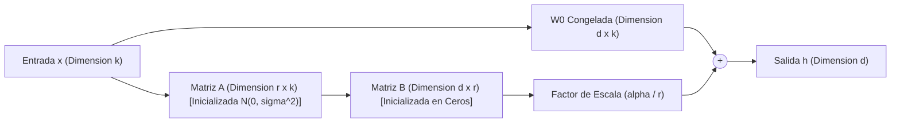
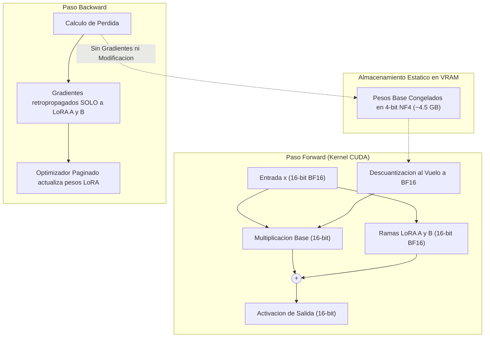
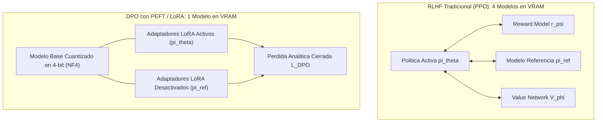
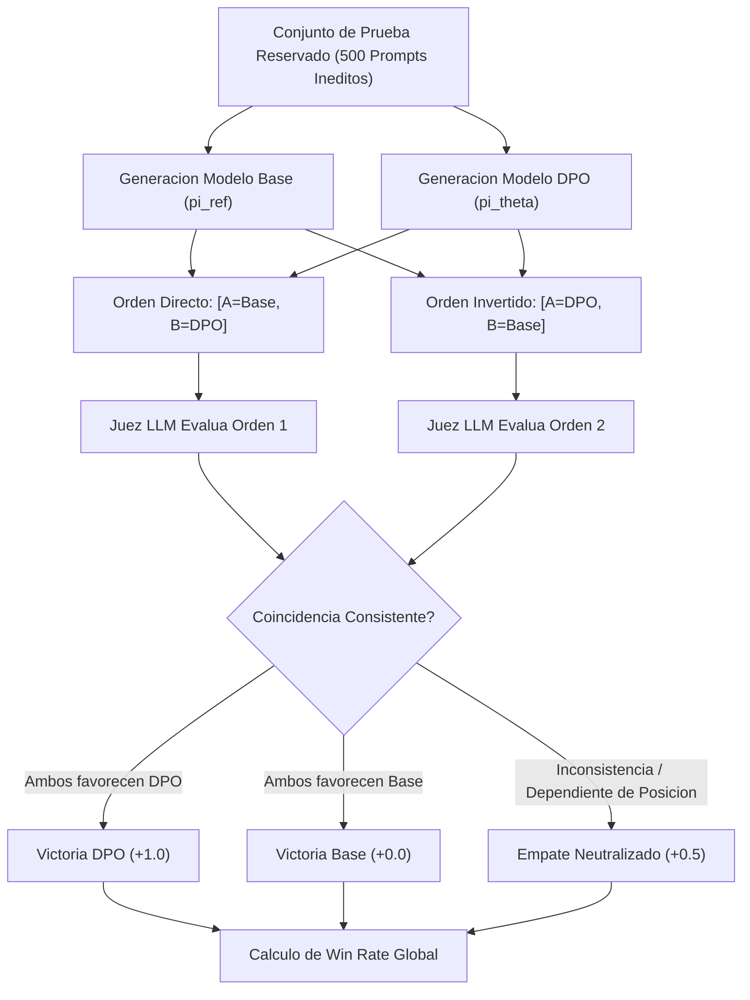

# Playbook Tecnico: Fine-Tuning de LLMs con LoRA, QLoRA, DPO y Unsloth

**Manual de Arquitectura, Fundamentos Matematicos, Optimizacion de Memoria, Aceleracion con Kernels Triton y Evaluacion Cuantitativa (Sesion 3)**

- **Audiencia Objetivo:** Ingenieros de Machine Learning, Arquitectos de Soluciones de IA, Tech Leads y Cientificos de Datos.
- **Ambito Tecnico:** Post-entrenamiento eficiente (PEFT), cuantizacion en punto flotante normal (NF4), alineacion directa de preferencias (DPO), optimizacion a nivel de GPU con Unsloth (OpenAI Triton), exportacion a GGUF y protocolos de evaluacion cuantitativa rigurosa (LLM-as-a-Judge).

---

## 1. Resumen Ejecutivo y Marco Conceptual

El ciclo de vida de los Modelos de Lenguaje Grande (LLMs) comprende tres fases sucesivas y diferenciadas:

1. **Pre-entrenamiento autosupervisado masivo:** El modelo procesa billones de tokens optimizando una funcion de perdida de entropia cruzada autorregresiva. Aunque esta etapa otorga fluidez linguistica y un vasto conocimiento factico enciclopedico, el modelo preentrenado resultante actua unicamente como un completador de secuencias probabilisticas, incapaz de seguir instrucciones complejas de forma confiable, segura o estructurada.
2. **Ajuste Fino Supervisado (SFT - Supervised Fine-Tuning):** Adapta el motor probabilistico mediante pares de instruccion-respuesta de alta calidad, habilitando capacidades conversacionales y especializacion en dominios tecnicos o corporativos.
3. **Alineacion de Preferencias (Preference Alignment):** Calibra las respuestas generadas con criterios de utilidad, veracidad y directrices de seguridad (safety), mitigando alucinaciones y refinando el estilo final.

```mermaid
flowchart LR
    subgraph Preentrenamiento
        Corpus["Corpus Masivo (Billones de Tokens)"] --> BaseLM["Modelo Base Preentrenado (Completador de Texto)"]
    end

    subgraph SFT["Ajuste Fino Supervisado (SFT)"]
        BaseLM --> SFTData["Pares de Instruccion (Prompt / Completion)"]
        SFTData --> InstructLM["Modelo Instructivo (SFT con LoRA/QLoRA)"]
    end

    subgraph Alineacion["Alineacion de Preferencias"]
        InstructLM --> PrefData["Dataset de Preferencias (Chosen vs Rejected)"]
        PrefData --> DPO["Optimizacion Directa (DPO)"]
        DPO --> AlignedLM["Modelo Alineado"]
    end

    subgraph Serving["Empaquetado y Serving (Sesion 4)"]
        AlignedLM --> UnslothGGUF["Unsloth & GGUF (Quantization)"]
        UnslothGGUF --> ProdServing["Inferencia en Ollama, vLLM y Cloud Run"]
    end
```



### El Desafio del Full Fine-Tuning

El ajuste fino completo (Full Fine-Tuning) de arquitecturas modernas (desde 7B hasta 70B de parametros) impone una barrera computacional prohibitiva: actualizar todos los pesos exige almacenar no solo los tensores del modelo en memoria de video (VRAM), sino tambien los gradientes y los estados del optimizador (como AdamW), demandando cientos de gigabytes de memoria dedicada de alto costo.

Este playbook documenta la metodologia integral que resuelve este desafio de escala:

- **LoRA (Low-Rank Adaptation):** Congela los pesos preentrenados e inyecta pares de matrices de bajo rango entrenables, reduciendo los parametros modificados en mas de un 99%.
- **QLoRA (Quantized Low-Rank Adaptation):** Cuantiza el modelo base congelado a 4 bits mediante NormalFloat4 (NF4) y doble cuantizacion, habilitando el ajuste fino de modelos de alta escala en GPUs comerciales sin degradacion de precision.
- **DPO (Direct Preference Optimization):** Suprime la complejidad, inestabilidad y sobrecarga de hardware del Reinforcement Learning from Human Feedback (RLHF) tradicional con PPO, derivando una funcion de perdida directa en forma cerrada sobre pares de respuestas preferidas y rechazadas.
- **Unsloth & Kernels Triton:** Acelera el entrenamiento reescribiendo los pasos de backpropagation en kernels personalizados de Triton, reduciendo hasta un 70% de consumo de VRAM y acelerando la computacion de 2x a 5x.
- **Evaluacion Cuantitativa Dual:** Combina metricas intrinsecas de recompensa probabilistica (Reward Accuracy) con benchmarks ciegos por pares utilizando LLM-as-a-Judge con mitigacion de sesgo posicional.

---

## 2. Fine-Tuning en LLMs: Justificacion y Taxonomia

### 2.1 Por que hacer Fine-Tuning frente a RAG e In-Context Learning?

En la ingenieria de sistemas basados en LLMs existen tres palancas complementarias: Prompt Engineering (In-Context Learning), Retrieval-Augmented Generation (RAG) y Fine-Tuning. Cada enfoque resuelve una necesidad estructural distinta:

| Criterio | In-Context Learning (Prompting) | RAG (Recuperacion Aumentada) | Fine-Tuning (LoRA / QLoRA / DPO) |
|---|---|---|---|
| **Objetivo Primario** | Instruccion rapida y contexto volatil de sesion. | Inyeccion de conocimiento factico dinamico y documentos externos. | Modificacion de comportamiento, tono, sintaxis, estilo y alineacion estricta. |
| **Modificacion de Pesos** | Ninguna (0%). | Ninguna (0%). | Modificacion modular (<1% con LoRA) o completa. |
| **Costo de Inferencia** | Alto (prompts largos y repetitivos consumen ventana de contexto). | Medio-Alto (busqueda vectorial, reranking y contexto amplio). | Bajo (los pesos ya interiorizan las reglas y el formato requerido). |
| **Especializacion Estilistica** | Fragil frente a instrucciones largas o dialecticas complejas. | Limitada al contenido del fragmento recuperado. | Robusta, uniforme y predecible a traves de miles de llamadas concurrentes. |

### 2.2 El Cuello de Botella de la Memoria en Full Fine-Tuning

Para comprender el origen de las tecnicas eficientes en parametros (PEFT), se debe desglosar el consumo de memoria en punto flotante de 16 bits (FP16 o BF16, donde cada parametro requiere 2 bytes):

1. **Pesos del Modelo:** 2 bytes por parametro. Un modelo de 7 billones de parametros requiere aproximadamente 14 GB unicamente para residir en VRAM.
2. **Gradientes:** 2 bytes por parametro (~14 GB adicionales durante el paso hacia atras / backward pass).
3. **Estados del Optimizador (AdamW):** AdamW mantiene dos estados internos por parametro entrenable: el primer momento (promedio movil de gradientes, 4 bytes FP32) y el segundo momento (promedio de cuadrados no centrados, 4 bytes FP32), mas una copia maestra de los pesos en FP32 (4 bytes). Esto acumula entre 12 y 16 bytes por parametro (~84 a 112 GB para un modelo 7B).
4. **Activaciones y buffers de atencion:** Memoria dinamica dependiente de la longitud de contexto, arquitectura de atencion y tamano del lote (batch size).

En consecuencia, un modelo aparentemente modesto de 7B parametros requiere mas de 120 GB de VRAM para un ajuste completo, forzando el uso de clusteres distribuidos de tarjetas aceleradoras de alta gama (NVIDIA A100/H100 de 80 GB).


---

## 3. LoRA: Descomposicion Matricial de Bajo Rango

### 3.1 Fundamento Conceptual y Matematico

Propuesto formalmente por Hu et al. (2021), LoRA (*Low-Rank Adaptation*) parte de una hipotesis fundamental: las actualizaciones de peso que sufre una red neuronal durante la adaptacion a una tarea especifica poseen una dimension intrinseca baja (*low intrinsic dimension*). Por ende, la matriz de modificacion acumulada puede parametrizarse con precision como el producto de dos matrices compactas de bajo rango.

Dada una capa densa preentrenada con matriz de pesos congelada $W_0 \in \mathbb{R}^{d \times k}$, ante una activacion de entrada $x$, la transformacion lineal convencional computa:

$$h = W_0 x$$

En lugar de actualizar directamente los coeficientes de $W_0$ (lo que requeriria calcular y almacenar gradientes sobre $d \times k$ elementos), LoRA modela el delta acumulado $\Delta W$ mediante una factorizacion de rango $r$, donde $r \ll \min(d, k)$:

$$h = W_0 x + \Delta W x = W_0 x + \frac{\alpha}{r} (B \cdot A) x$$

Donde:
- **Matriz $A \in \mathbb{R}^{r \times k}$:** Inicializada con una distribucion normal aleatoria $\mathcal{N}(0, \sigma^2)$.
- **Matriz $B \in \mathbb{R}^{d \times r}$:** Inicializada estrictamente en ceros ($0$). Esto garantiza que en el primer paso de entrenamiento $\Delta W = B \cdot A = 0$, por lo que el comportamiento del modelo inicia de forma exacta en el punto de preentrenamiento sin saltos bruscos.
- **Parametro de rango ($r$):** Dimension interna del cuello de botella (tipicamente configurado entre 8 y 64).
- **Factor de escala ($\frac{\alpha}{r}$):** Constante normalizadora que calibra la magnitud de la actualizacion adaptativa frente a la rama original congelada.



### 3.2 Ejercicio Numerico Detallado de Reduccion de Parametros

Consideremos una matriz lineal tipica dentro del bloque de atencion de un modelo moderno (como LLaMA-8B), donde la dimension oculta es $d = 4096$ y la proyeccion lineal proyecta a $k = 4096$:

1. **Parametros en Full Fine-Tuning:**
   $$\text{Parametros} = d \times k = 4096 \times 4096 = 16,777,216 \text{ parametros por capa}$$

2. **Parametros con LoRA (configurando rango $r = 8$):**
   - Matriz $A$: $r \times k = 8 \times 4096 = 32,768 \text{ parametros}$
   - Matriz $B$: $d \times r = 4096 \times 8 = 32,768 \text{ parametros}$
   - Total de parametros entrenables en LoRA:
     $$32,768 + 32,768 = 65,536 \text{ parametros}$$

3. **Calculo del porcentaje de parametros entrenables:**
   $$\text{Porcentaje Entrenable} = \left( \frac{65,536}{16,777,216} \right) \times 100 = 0.3906\%$$

Este resultado demuestra que se actualiza unicamente el 0.39% de los parametros de la capa. En consecuencia, se reduce en un **99.61%** la memoria requerida para gradientes y estados del optimizador en dicho modulo.

### 3.3 El Rol de `lora_alpha` y el Factor de Escala ($\frac{\alpha}{r}$)

El factor normalizador $\frac{\alpha}{r}$ cumple dos roles criticos de estabilidad hiperparametrica:

1. **Invarianza ante la variacion de rango:** Cuando se ajusta $r$ (por ejemplo, incrementando de 8 a 64 para capturar mayor expresividad), la norma de Frobenius del producto matricial $B \cdot A$ escala proporcionalmente con $r$. Al normalizar dividiendo entre $r$, la escala efectiva de las actualizaciones permanece constante, eliminando la necesidad de reajustar exhaustivamente la tasa de aprendizaje (*learning rate*) en cada experimento.
2. **Control de intensidad de aprendizaje:** $\alpha$ funciona como una ganancia sobre el gradiente efectivo. Fijar $\alpha = 2r$ (por ejemplo, $r=8, \alpha=16$ o $r=16, \alpha=32$) es una convencion canonica recomendada por la comunidad cientifica para otorgar suficiente ponderacion a la adaptacion sin inducir inestabilidades numericas.

### 3.4 Cero Latencia en Inferencia: Fusion de Pesos (Weight Merging)

A diferencia de los esquemas tradicionales de adaptacion secuencial (que introducen capas intermedias anadidas y penalizan la latencia en inferencia), LoRA permite la integracion analitica de pesos al culminar el entrenamiento:

$$W_{\text{final}} = W_0 + \frac{\alpha}{r} (B \cdot A)$$

La matriz resultante $W_{\text{final}}$ posee exactamente las mismas dimensiones $(d \times k)$ que la matriz base original. Para el despliegue en produccion se sirve una matriz unificada sin ramas en paralelo, garantizando latencia identica a la del modelo base original.

---

## 4. QLoRA: Cuantizacion de Precision Reducida y Eficiencia Extrema

### 4.1 Fundamento de QLoRA (Dettmers et al., 2023)

Aunque LoRA abate la memoria requerida por gradientes y optimizadores, el modelo base $W_0$ debia mantenerse en precision de 16 bits (FP16 o BF16), lo que aun requeria entre 16 y 24 GB de VRAM solo para alojar los tensores estaticos de un modelo 7B/8B. QLoRA (*Quantized Low-Rank Adaptation*) supera esta barrera integrando tres innovaciones algoritmicas esenciales:

### 4.2 Componentes Esenciales de QLoRA

1. **Tipo de Dato NormalFloat4 (NF4):**
   Los pesos de las redes neuronales preentrenadas no presentan una distribucion uniforme, sino que siguen una distribucion normal centrada en cero: $W \sim \mathcal{N}(0, \sigma^2)$. Los formatos tradicionales de cuantizacion entera uniforme (INT4) dividen el espacio en intervalos equidistantes, desperdiciando capacidad de representacion en las colas. NF4 construye 16 cuantiles discretos de tal modo que cada bin posea exactamente la misma probabilidad de ocurrencia bajo una curva gaussiana estandar, minimizando el error cuadratico medio (MSE) de cuantizacion sin requerir bits adicionales.
2. **Doble Cuantizacion (Double Quantization - DQ):**
   Para transformar los pesos a NF4 se dividen en bloques de tamano $B_1 = 64$, calculando una constante de escala $c_1$ por bloque. Almacenar estas constantes en FP32 agregaria $\frac{32}{64} = 0.5$ bits por parametro. QLoRA aplica una segunda cuantizacion a 8 bits (FP8) sobre las propias constantes de escala en bloques de $B_2 = 256$, reduciendo la sobrecarga de escala de 0.5 bits/parametro a solo **0.127 bits por parametro**, lo que representa un ahorro de ~3 GB en un modelo de 65B.
3. **Optimizadores Paginados (Paged Optimizers):**
   Aprovecha la memoria unificada de CUDA (*NVIDIA Unified Memory*) para trasladar de forma asincrona los estados del optimizador inactivos entre la VRAM de la GPU y la memoria RAM del sistema operativo (host CPU) durante fases de alta demanda, previniendo fallos por falta de memoria (*Out of Memory - OOM*).

### 4.3 Mecanica de Computo: Descuantizacion al Vuelo (On-the-Fly)

En QLoRA las operaciones matematicas no se calculan en 4 bits. El ciclo de computo opera de la siguiente manera:

1. Los pesos base $W_0$ residen de manera estatica y comprimida en la VRAM en formato NF4 de 4 bits.
2. Al recibir el tensor de entrada $x$ en precision de 16 bits (BF16), un kernel especializado de CUDA descuantiza dinamicamente un bloque de pesos base a BF16 en registros rapidos de la GPU unicamente para ejecutar la multiplicacion matricial.
3. La operacion $W_0 x$ se resuelve en 16 bits y el resultado se suma vectorialmente a la salida de las ramas LoRA ($B \cdot A \cdot x$), que se entrenan nativamente en 16 bits.
4. Durante la retropropagacion (*backward pass*), los gradientes se calculan y actualizan **exclusivamente sobre las matrices LoRA $A$ y $B$ en 16 bits**. Los pesos base en 4 bits jamas calculan gradientes ni sufren modificaciones.



---

## 5. DPO: Alineacion Directa de Preferencias

### 5.1 Anatomia del RLHF Clasico vs. Paradigma DPO

El proceso tradicional de alineacion mediante Aprendizaje por Refuerzo con Retroalimentacion Humana (RLHF) consta de dos fases complejas posteriores al SFT:

1. **Entrenamiento del Modelo de Recompensa (Reward Model):** Se entrena un modelo discriminador $r_\psi(x, y)$ que asigna una puntuacion escalar a una respuesta $y$ dado un contexto $x$, optimizado mediante clasificaciones binarias bajo el modelo de eleccion de Bradley-Terry.
2. **Optimizacion por Refuerzo de la Politica (PPO):** El modelo de lenguaje $\pi_\theta$ genera secuencias completas en tiempo real, el modelo de recompensa $r_\psi$ las evalua, y el algoritmo PPO (*Proximal Policy Optimization*) ajusta los pesos de $\pi_\theta$ incorporando una penalizacion de divergencia KL frente a una copia inmutable del modelo base $\pi_{\text{ref}}$.

Este esquema presenta severas restricciones de ingenieria:
- **Sobrecarga Extrema de Memoria:** Obliga a mantener simultaneamente 4 modelos en VRAM: la politica activa ($\pi_\theta$), el modelo de referencia congelado ($\pi_{\text{ref}}$), el modelo de recompensa ($r_\psi$) y el estimador de valor critico ($V_\phi$).
- **Inestabilidad Algoritmica:** PPO exhibe alta sensibilidad a hiperparametros, colapsos de gradiente y fenomenos de optimizacion espuria (*reward hacking*), donde el generador detecta patrones sintacticos artificiales que maximizan el score sin aportar calidad real.

### 5.2 La Derivacion Analitica de DPO (Rafailov et al., 2023)

Direct Preference Optimization demuestra analiticamente que es posible prescindir totalmente de un modelo de recompensa explicito y del bucle interactivo de RL.

El objetivo clasico de maximizacion con penalizacion por divergencia de Kullback-Leibler se formula como:

$$\max_{\pi} \mathbb{E}_{x \sim \mathcal{D}, y \sim \pi} [r(x, y)] - \beta \, \mathbb{D}_{\text{KL}}(\pi(y|x) \parallel \pi_{\text{ref}}(y|x))$$

La solucion teorica exacta y en forma cerrada a este problema de optimizacion es:

$$\pi^*(y|x) = \frac{1}{Z(x)} \pi_{\text{ref}}(y|x) \exp\left( \frac{1}{\beta} r(x, y) \right)$$

Donde $Z(x) = \sum_y \pi_{\text{ref}}(y|x) \exp\left( \frac{1}{\beta} r(x, y) \right)$ es la funcion de particion normalizadora. Despejando formalmente la funcion de recompensa $r(x, y)$:

$$r(x, y) = \beta \log \frac{\pi^*(y|x)}{\pi_{\text{ref}}(y|x)} + \beta \log Z(x)$$

Bajo el modelo de preferencias probabilisticas de Bradley-Terry (1952), la probabilidad de que una respuesta preferida $y_w$ gane sobre una respuesta rechazada $y_l$ depende unicamente de la diferencia escalar de sus recompensas:

$$P(y_w \succ y_l \mid x) = \sigma(r(x, y_w) - r(x, y_l))$$

Al sustituir la expresion analitica de $r(x, y)$ en la resta, el termino dependiente de la funcion de particion $\beta \log Z(x)$ es identico en ambos factores y **se cancela de manera exacta**:

$$r(x, y_w) - r(x, y_l) = \beta \log \frac{\pi_\theta(y_w|x)}{\pi_{\text{ref}}(y_w|x)} - \beta \log \frac{\pi_\theta(y_l|x)}{\pi_{\text{ref}}(y_l|x)}$$

Minimizando la log-verosimilitud negativa del conjunto de preferencias, se obtiene la funcion de perdida cerrada de DPO:

$$\mathcal{L}_{\text{DPO}}(\theta; \pi_{\text{ref}}) = - \mathbb{E}_{(x, y_w, y_l) \sim \mathcal{D}} \left[ \log \sigma \left( \beta \log \frac{\pi_\theta(y_w|x)}{\pi_{\text{ref}}(y_w|x)} - \beta \log \frac{\pi_\theta(y_l|x)}{\pi_{\text{ref}}(y_l|x)} \right) \right]$$



### 5.3 Dinamica del Gradiente y Mecanica de Penalizacion

Al derivar la funcion de perdida $\mathcal{L}_{\text{DPO}}$ respecto a los parametros $\theta$:

$$\nabla_\theta \mathcal{L}_{\text{DPO}}(\theta) = - \beta \, \sigma\left( \hat{r}_\theta(x, y_l) - \hat{r}_\theta(x, y_w) \right) \left[ \nabla_\theta \log \pi_\theta(y_w|x) - \nabla_\theta \log \pi_\theta(y_l|x) \right]$$

Donde $\hat{r}_\theta(x, y) = \beta \log \frac{\pi_\theta(y|x)}{\pi_{\text{ref}}(y|x)}$. Esta formulacion revela dos comportamientos fundamentales:

1. **Ponderacion de error adaptativa:** El coeficiente $\sigma(\hat{r}_\theta(x, y_l) - \hat{r}_\theta(x, y_w))$ escala el gradiente. Si el modelo califica incorrectamente la respuesta rechazada $y_l$ por encima de la preferida $y_w$, el argumento es positivo y el factor sigmoide se aproxima a 1, generando una correccion de gradiente muy potente. Si el modelo ya clasifica correctamente $y_w$ con alto margen, el factor tiende a 0, evitando perturbar los pesos innecesariamente.
2. **Direccionalidad del ajuste:** El gradiente eleva simultaneamente la probabilidad de los tokens de la respuesta ganadora $y_w$ ($\nabla \log \pi(y_w|x)$ positivo) y disminuye activamente la probabilidad de emision de los tokens de la respuesta perdedora $y_l$ ($-\nabla \log \pi(y_l|x)$).

### 5.4 Sinergia Operativa: DPO + QLoRA

DPO requiere evaluar dos politicas: la red activa ($\pi_\theta$) y el modelo de referencia congelado ($\pi_{\text{ref}}$). Si se implementara con modelos independientes, seria necesario cargar dos copias completas en memoria. La combinacion de DPO con adaptadores PEFT resuelve este conflicto de forma elegante:

- Se instancia un unico modelo base cuantizado en 4 bits (NF4). Este tensor base permanece inmutable y representa a $\pi_{\text{ref}}$ cuando los adaptadores estan desactivados.
- Se inyectan adaptadores LoRA en 16 bits que representan a la politica activa $\pi_\theta$.
- Frameworks como Hugging Face TRL ejecutan el paso forward desactivando temporalmente los adaptadores (`with model.disable_adapter():`) para calcular $\pi_{\text{ref}}(y|x)$ y luego los reactivan para computar $\pi_\theta(y|x)$, operando sobre una unica GPU sin requerir hardware adicional.

---

## 6. Curaduria de Datasets y Prevencion de Sesgos

### 6.1 Dataset de Preferencias Ternario (Prompt, Chosen, Rejected)

Un dataset valido para DPO se estructura obligatoriamente en tuplas ternarias:

| Campo | Descripcion Funcional | Ejemplo de Referencia |
|---|---|---|
| `prompt` ($x$) | Instruccion o contexto suministrado al sistema. | *"Explica que es un deadlock en sistemas operativos."* |
| `chosen` ($y_w$) | Respuesta preferida: factualmente exacta, estructurada y sin verborrea. | *"Un deadlock o interbloqueo ocurre cuando dos o mas procesos quedan bloqueados indefinidamente porque cada uno retiene un recurso que el otro necesita para continuar. Para que ocurra deben cumplirse simultaneamente cuatro condiciones de Coffman: exclusion mutua, retencion y espera, no apropiacion y espera circular."* |
| `rejected` ($y_l$) | Respuesta descartada: vaga, conceptualmente incorrecta o alucinada. | *"Un deadlock es cuando la computadora se traba porque la memoria RAM se llena con muchos programas abiertos al mismo tiempo."* |

### 6.2 Control del Sesgo de Longitud (Length Bias)

Los algoritmos basados en optimizacion de preferencias sufren un riesgo bien documentado en la literatura cientifica: la sobreoptimizacion de longitud (*Length Bias*). Si en el dataset de entrenamiento las respuestas elegidas son sistematicamente mas extensas que las rechazadas, el optimizador aprende a premiar la verbosidad superficial en detrimento de la precision tecnica.

**Regla de Curaduria:** Es imperativo incluir de forma balanceada pares de entrenamiento donde la respuesta preferida sea significativamente mas concisa, puntual y directa que la respuesta rechazada.

### 6.3 Plantillas de Chat y Enmascaramiento de Respuesta (Response Masking)

En tareas de SFT conversacional, el modelo procesa secuencias compuestas por turnos de usuario y asistente estructuradas mediante plantillas Jinja2 (`apply_chat_template`). Para evitar que el modelo intente predecir o memorizar las preguntas del usuario, se aplica enmascaramiento de respuesta (*response masking*) con `DataCollatorForCompletionOnlyLM`:

- Todos los tokens correspondientes al sistema y al usuario reciben una etiqueta de perdida de `-100`, indicando a la funcion de perdida de PyTorch ignorarlos.
- El gradiente se computa **unicamente sobre los tokens de la respuesta del asistente**, maximizando la densidad de senal util por paso de entrenamiento.

---

## 7. Post-Entrenamiento Acelerado con Unsloth y Exportacion a GGUF

### 7.1 Optimizacion a Nivel de Kernel con OpenAI Triton

Unsloth redefine el rendimiento del fine-tuning reescribiendo los cuellos de botella computacionales de PyTorch y Hugging Face directamente en **OpenAI Triton**:

1. **Backpropagation Analitica Manual:** En lugar de depender de la cinta de autograd de PyTorch (que retiene grafos y activaciones intermedias masivas en VRAM), Unsloth deriva las formulas analiticas de gradientes para capas de atencion, activaciones GeLU/SwiGLU y RoPE, ejecutandolas en un unico kernel fusionado.
2. **Cross-Entropy Fusionada:** La computacion convencional de Cross-Entropy proyecta los estados ocultos hacia el vocabulario completo ($V \approx 32,000 \text{ a } 128,000$), creando tensores gigantescos en VRAM. El kernel Triton de Unsloth calcula la perdida y el gradiente de forma simultanea por bloques, reduciendo el consumo de memoria en la capa de salida en mas de un 80%.
3. **Impacto Cuantitativo:** Se logra una reduccion de hasta el **70% de VRAM** y una aceleracion de **2x a 5x** en la velocidad de entrenamiento respecto al stack estandar de PEFT/TRL.

```mermaid
flowchart TD
    subgraph PyTorch_Standard["Stack Estandar (PyTorch + Hugging Face)"]
        H_State["Estados Ocultos (B, L, H)"] --> ProjVocab["Proyeccion a Vocabulario Gigante (B, L, V) [Alto VRAM]"]
        ProjVocab --> Softmax["Softmax sobre Vocabulario"]
        Softmax --> LossStd["Cross Entropy Loss"]
        LossStd --> Autograd["Autograd almacena todo el grafo en VRAM"]
    end

    subgraph Unsloth_Triton["Aceleracion Unsloth (OpenAI Triton Kernels)"]
        H_State2["Estados Ocultos"] --> FusedKernel["Kernel Triton Fusionado: Cross-Entropy por Bloques"]
        FusedKernel --> LossFast["Calculo de Perdida y Gradientes en Registros"]
        LossFast --> NoGraph["Sin retencion de activaciones masivas (Ahorro 70% VRAM)"]
    end
```



### 7.2 Exportacion a Formato GGUF y Puente a Produccion

El post-entrenamiento en la Sesion 3 se articula de forma directa con la puesta en produccion en la Sesion 4 mediante la exportacion al formato binario **GGUF** (*GPT-Generated Unified Format*):

- **Tipos de Cuantizacion Recomendados:**
  - `q4_k_m`: Formato estandar balanceado de 4 bits con cuantizacion mixta por bloques (k-quants). Ofrece la mejor relacion entre reduccion de tamano (~4.5 GB para 8B) y preservacion de perplejidad.
  - `q8_0`: Cuantizacion casi sin perdida a 8 bits, recomendada para tareas de alta precision logica o extraccion estructurada de JSON.
- **Creacion de Modelfiles para Ollama:** El binario GGUF resultante se acompana de un archivo `Modelfile` que codifica la plantilla de chat, parametros de decodificacion (`temperature`, `top_p`) y el prompt de sistema, habilitando serving local inmediato o despliegue en Google Cloud Run.

---

## 8. Pipelines de Entrenamiento en Produccion (TRL & Unsloth)

### 8.1 Pipeline QLoRA con DPOTrainer (Hugging Face TRL & PEFT)

```python
import torch
from datasets import load_dataset
from transformers import AutoModelForCausalLM, AutoTokenizer, BitsAndBytesConfig
from peft import LoraConfig, prepare_model_for_kbit_training
from trl import DPOConfig, DPOTrainer

# 1. Configuracion de cuantizacion extrema QLoRA (NF4 de 4 bits con doble cuantizacion)
bnb_config = BitsAndBytesConfig(
    load_in_4bit=True,
    bnb_4bit_quant_type="nf4",
    bnb_4bit_compute_dtype=torch.bfloat16,
    bnb_4bit_use_double_quant=True
)

model_id = "meta-llama/Meta-Llama-3-8B-Instruct"

tokenizer = AutoTokenizer.from_pretrained(model_id)
if tokenizer.pad_token is None:
    tokenizer.pad_token = tokenizer.eos_token

# 2. Carga del modelo base congelado en 4 bits
model = AutoModelForCausalLM.from_pretrained(
    model_id,
    quantization_config=bnb_config,
    device_map="auto",
    torch_dtype=torch.bfloat16
)
model = prepare_model_for_kbit_training(model)

# 3. Configuracion de adaptadores LoRA sobre modulos de atencion y MLP
peft_config = LoraConfig(
    r=16,
    lora_alpha=32,
    lora_dropout=0.05,
    bias="none",
    task_type="CAUSAL_LM",
    target_modules=[
        "q_proj", "k_proj", "v_proj", "o_proj",
        "gate_proj", "up_proj", "down_proj"
    ]
)

# 4. Hiperparametros de entrenamiento de DPO
dpo_config = DPOConfig(
    output_dir="./output_dpo_qlora",
    beta=0.1,                           # Coeficiente de restriccion KL (0.05 a 0.2)
    learning_rate=5e-6,                 # Tasa reducida para adaptadores en alineacion
    lr_scheduler_type="cosine",
    warmup_ratio=0.1,
    per_device_train_batch_size=2,
    gradient_accumulation_steps=4,
    max_length=1024,
    max_prompt_length=512,
    num_train_epochs=3,
    optim="paged_adamw_8bit",           # Optimizador paginado para control de picos de VRAM
    bf16=True,
    logging_steps=10,
    save_strategy="epoch",
    eval_strategy="steps",
    eval_steps=100
)

# 5. Carga de datos de preferencia
dataset = load_dataset("json", data_files="dpo_preferences.jsonl")

# 6. Inicializacion del DPOTrainer
# Nota: Al pasar ref_model=None junto a peft_config, el trainer utiliza automaticamente
# el modelo base congelado desactivando los adaptadores para calcular pi_ref en memoria.
trainer = DPOTrainer(
    model=model,
    ref_model=None,
    peft_config=peft_config,
    args=dpo_config,
    train_dataset=dataset["train"],
    processing_class=tokenizer
)

# 7. Ejecucion y guardado del adaptador final
trainer.train()
trainer.save_model("./modelo_final_dpo_qlora")
```

### 8.2 Pipeline de Fine-Tuning y Exportacion GGUF con Unsloth

```python
from unsloth import FastLanguageModel
import torch

# 1. Carga acelerada con kernels Triton precompilados
max_seq_length = 2048
model, tokenizer = FastLanguageModel.from_pretrained(
    model_name="unsloth/gemma-2-9b-bnb-4bit",
    max_seq_length=max_seq_length,
    load_in_4bit=True,
    dtype=None  # Deteccion automatica (Float16 o Bfloat16)
)

# 2. Inyeccion de LoRA optimizado en todas las matrices lineales
model = FastLanguageModel.get_peft_model(
    model,
    r=16,
    target_modules=["q_proj", "k_proj", "v_proj", "o_proj",
                    "gate_proj", "up_proj", "down_proj"],
    lora_alpha=32,
    lora_dropout=0.0,  # Unsloth optimiza a dropout 0
    bias="none",
    use_gradient_checkpointing="unsloth"  # Ahorro extremo de VRAM
)

# 3. Exportacion directa a GGUF (q4_k_m) para Ollama / vLLM
model.save_pretrained_gguf(
    "modelo_gemma_finetuned_gguf",
    tokenizer,
    quantization_method="q4_k_m"
)
```

---

## 9. Metricas de Evaluacion y Diagnostico Cuantitativo

### 9.1 Metricas Intrinsecas Durante el Entrenamiento

Durante el entrenamiento con DPO se deben monitorear y registrar las siguientes cuatro metricas numericas primarias:

- `rewards/margins`: Diferencia escalar promedio entre la recompensa implicita de la respuesta elegida y la rechazada: $\hat{r}(x, y_w) - \hat{r}(x, y_l)$. Debe mostrar una pendiente estrictamente positiva a lo largo de las epocas y converger en un valor positivo estable.
- `rewards/accuracies`: Proporcion de pares evaluados donde el modelo asigna formalmente mayor valor a $y_w$ que a $y_l$. Un valor entre **0.70 y 0.85** refleja una alineacion robusta. Si el valor fluctua en torno a **0.50**, el modelo no esta aprendiendo a discriminar y clasifica al azar.
- `rewards/chosen` vs. `rewards/rejected`: El valor promedio asignado a las respuestas elegidas debe aumentar o mantenerse controlado, mientras que el valor asignado a las respuestas rechazadas debe declinar sostenidamente.
- `loss`: Perdida sigmoide de DPO. Un descenso suave evidencia convergencia adecuada. Oscilaciones caoticas son sintoma de una tasa de aprendizaje excesiva o de un $\beta$ demasiado pequeno.

### 9.2 Protocolo de Evaluacion Cuantitativa: LLM-as-a-Judge

Para validar cuantitativamente el modelo resultante frente al modelo base sin depender de inspecciones cualitativas subjetivas, se implementa el estandar industrial de evaluacion por pares ciegos (*blind pairwise benchmark*) con un modelo juez de frontera (como GPT-4o o Claude 3.5 Sonnet):



1. **Generacion en Conjunto de Prueba Reservado:** Se alimentan 500 prompts ineditos tanto al modelo base ($\pi_{\text{ref}}$) como al modelo adaptado con DPO ($\pi_\theta$) fijando parametros de muestreo deterministas (`temperature=0.7`, `top_p=0.9`).
2. **Mitigacion de Sesgo de Posicion (*Position Bias*):** Los evaluadores LLM presentan una marcada tendencia empirica a favorecer la primera opcion presentada en el prompt. Para neutralizar este sesgo, cada comparacion se evalua dos veces intercambiando el orden: `[A: Base, B: DPO]` y `[A: DPO, B: Base]`. Si el juez cambia su eleccion dependiendo unicamente de la posicion, el caso se categoriza como Empate (*Tie*).
3. **Calculo del Win Rate Cuantitativo:** Se computa la proporcion de victorias netas segun la formula estandarizada:
   $$\text{Win Rate} = \frac{\text{Victorias}_{\text{DPO}} + 0.5 \times \text{Empates}}{\text{Total de Comparaciones}}$$
   Un **Win Rate superior al 60%** sobre prompts no vistos certifica una mejora estadisticamente significativa de la alineacion del modelo.

---

## 10. Referencias Bibliograficas y Recursos Canonicos

### Articulos de Investigacion Cientifica (Papers)

- **Hu, E. J., Shen, Y., Wallis, P., Allen-Zhu, Z., Li, Y., Wang, S., Wang, L., & Chen, W. (2021).** *LoRA: Low-Rank Adaptation of Large Language Models.* International Conference on Learning Representations (ICLR 2022). [arXiv:2106.09685](https://arxiv.org/abs/2106.09685)
- **Dettmers, T., Pagnoni, A., Holtzman, A., & Zettlemoyer, L. (2023).** *QLoRA: Efficient Finetuning of Quantized LLMs.* Advances in Neural Information Processing Systems (NeurIPS 2023). [arXiv:2305.14314](https://arxiv.org/abs/2305.14314)
- **Rafailov, R., Sharma, A., Mitchell, E., Ermon, S., Manning, C. D., & Finn, C. (2023).** *Direct Preference Optimization: Your Language Model is Secretly a Reward Model.* Advances in Neural Information Processing Systems (NeurIPS 2023). [arXiv:2305.18290](https://arxiv.org/abs/2305.18290)
- **Bradley, R. A., & Terry, M. E. (1952).** *Rank analysis of incomplete block designs: I. The method of paired comparisons.* Biometrika, 39(3/4), 324-345.
- **Ouyang, L., Wu, J., Jiang, X., et al. (2022).** *Training language models to follow instructions with human feedback.* Advances in Neural Information Processing Systems (NeurIPS 2022), 35, 27730-27744.
- **Zheng, L., Chiang, W. L., Sheng, Y., et al. (2023).** *Judging LLM-as-a-Judge with MT-Bench and Chatbot Arena.* Advances in Neural Information Processing Systems (NeurIPS 2023). [arXiv:2306.05685](https://arxiv.org/abs/2306.05685)
- **Li, X., Zhang, T., Dubois, Y., Taori, R., et al. (2023).** *AlpacaEval: An Automatic Evaluator of Instruction-following Models.* GitHub Repository. [https://github.com/tatsu-lab/alpaca_eval](https://github.com/tatsu-lab/alpaca_eval)
- **Tillet, P., Kung, H. T., & Cox, D. (2019).** *Triton: An Intermediate Language and Compiler for Tiled Neural Network Computations.* Proceedings of the 3rd ACM SIGPLAN International Workshop on Libraries, Languages, and Compilers for Array Programming. [ACM Digital Library](https://doi.org/10.1145/3315454.3329953)

### Documentacion Oficial y Ecosistema Open Source

- **Hugging Face TRL (Transformer Reinforcement Learning):** [https://huggingface.co/docs/trl/](https://huggingface.co/docs/trl/)
- **Hugging Face PEFT (Parameter-Efficient Fine-Tuning):** [https://huggingface.co/docs/peft/](https://huggingface.co/docs/peft/)
- **Unsloth AI Documentation:** [https://docs.unsloth.ai/](https://docs.unsloth.ai/)
- **Guia Oficial del Formato GGUF en Hugging Face Hub:** [https://huggingface.co/docs/hub/gguf](https://huggingface.co/docs/hub/gguf)
- **Ecosistema Ollama (Modelfile & Serving):** [https://ollama.com/](https://ollama.com/)
- **vLLM (PagedAttention & Serving):** [https://docs.vllm.ai/](https://docs.vllm.ai/)
